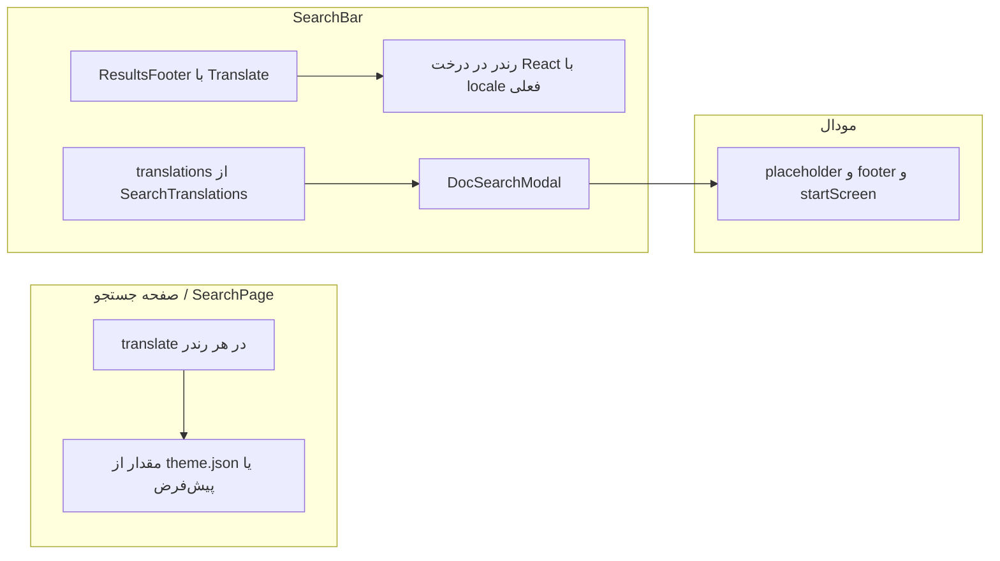

# پلن: رفع ترجمه‌نشدن مودال و به‌روز نشدن بعد از ریلیز

## ۱. چرا بعضی عبارت‌ها ترجمه می‌شوند و بعضی (در مودال) نه؟

### جریان دادهٔ ترجمه

- **چیزهایی که درست هستند** (مثل «نتایج جستجو برای»، «سند پیدا شد»، «عبارت خود را…»، و **«مشاهده همه 1068 نتیجه»**):
  - یا مستقیم در کامپوننت با `translate()` / `<Translate>` صدا زده می‌شوند (هر بار با locale فعلی)،
  - یا مثل لینک «مشاهده همه …» داخل **ResultsFooter** با `<Translate>` رندر می‌شوند و در زمان رندر مقدار درست را می‌گیرند.

- **چیزهایی که در مودال انگلیسی می‌مانند** (placeholder، to select، to navigate، Recent، Search by و …):
  - از آبجکت **از پیش ساخته** `translations` می‌آیند که در [src/theme/SearchTranslations/index.ts](e:\saberprojects-eeeee\kasra\docu sauros\docusaurus-theme-search-typesense\src\theme\SearchTranslations\index.ts) یک‌بار در **زمان لود ماژول** با `translate()` پر می‌شوند.
  - پروژهٔ مصرف‌کننده (مثلاً kasra-docs) در زمان اجرا از **خروجی کامپایل‌شده** استفاده می‌کند، نه از سورس تم.

### علت اصلی: ناهماهنگی بین `src` و `lib`

- در **سورس** ([src/theme/SearchTranslations/index.ts](e:\saberprojects-eeeee\kasra\docu sauros\docusaurus-theme-search-typesense\src\theme\SearchTranslations\index.ts)) پیام‌های پیش‌فرض همه **فارسی** هستند (مثل «جستجو در مستندات»، «اخیر»، «برای انتخاب» و …).
- در **خروجی بیلد** ([lib/theme/SearchTranslations/index.js](e:\saberprojects-eeeee\kasra\docu sauros\docusaurus-theme-search-typesense\lib\theme\SearchTranslations\index.js)) هنوز پیام‌های پیش‌فرض **انگلیسی** هستند (`'Search'`, `'Recent'`, `'to select'`, `'Search docs'` و …).

وقتی سایت با این تم بیلد می‌شود، کدی که اجرا می‌شود از داخل **پکیج** است و آن کد همان `lib/theme/SearchTranslations/index.js` است. اگر در آن فایل هنوز `message: 'Recent'` و مشابه باشد، در صورت نبود یا عدم اعمال صحیح theme.json برای این تم، همان پیش‌فرض انگلیسی استفاده می‌شود. در نتیجه **مودال** (که فقط از همین آبجکت `translations` استفاده می‌کند) انگلیسی نشان می‌دهد، در حالی که **صفحهٔ جستجو و ResultsFooter** یا از theme یا از کامپوننت‌هایی با `translate` در زمان رندر مقدار می‌گیرند و درست نمایش داده می‌شوند.

---

## ۲. چرا بعد از ریلیز و `npm i` به‌روز نمی‌شود و باید پوشهٔ بیلد کلین شود؟

دو طرف ماجرا هست:

### الف) طرف پکیج تم (docusaurus-theme-search-typesense)

- در [package.json](e:\saberprojects-eeeee\kasra\docu sauros\docusaurus-theme-search-typesense\package.json) ورودی اصلی پکیج `"main": "lib/index.js"` است؛ یعنی بعد از `npm i` همان چیزی که داخل **lib** پکیج است اجرا می‌شود.
- اگر قبل از `npm publish` دستور **`npm run build`** اجرا نشود، فایل‌های قدیمی داخل `lib` (با همان پیام‌های انگلیسی) در تاربال منتشر می‌شوند. در نتیجه حتی با نصب نسخهٔ جدید، کد اجراشده همان بیلد قدیمی است و ترجمه‌های مودال به‌روز نمی‌شوند.

### ب) طرف پروژهٔ مصرف‌کننده (مثلاً kasra-docs)

- Docusaurus و باندلر (مثلاً Webpack) خروجی بیلد و چانک‌ها را کش می‌کنند (مثلاً در `.docusaurus` یا پوشهٔ `build`). بعد از `npm i` ممکن است هنوز از همان چانک‌های قدیمی استفاده شود.
- با **پاک کردن پوشهٔ بیلد و کش** (مثلاً `.docusaurus` و `build`) و بیلد مجدد، همه‌چیز از نو از `node_modules` خوانده می‌شود و نسخهٔ جدید پکیج تم اعمال می‌شود.

---

## ۳. کارهایی که باید انجام شوند

### ۳.۱ رفع ترجمه‌نشدن مودال (اولویت اصلی)

- **هدف:** مطمئن شدن که کدی که در runtime اجرا می‌شود (یعنی محتوای `lib`) همان پیش‌فرض‌های فارسی را دارد که در `src` نوشته شده‌اند.
- **اقدام:** در همین ریپوی تم، یک بار **بیلد تم** را اجرا کنید تا از روی سورس فعلی (با همهٔ messageهای فارسی در [src/theme/SearchTranslations/index.ts](e:\saberprojects-eeeee\kasra\docu sauros\docusaurus-theme-search-typesense\src\theme\SearchTranslations\index.ts)) فایل‌های `lib` از نو ساخته شوند:
  - در روت پکیج تم: `npm run build` (یا `yarn build`).
- **بررسی:** بعد از بیلد، محتوای [lib/theme/SearchTranslations/index.js](e:\saberprojects-eeeee\kasra\docu sauros\docusaurus-theme-search-typesense\lib\theme\SearchTranslations\index.js) باید با سورس هماهنگ باشد؛ یعنی همهٔ `message:`ها در `translate(...)` معادل فارسی باشند (مثل «جستجو در مستندات»، «اخیر»، «برای انتخاب»، «فلش بالا» و …)، نه انگلیسی.
- اگر تم را به صورت **لوکال** در kasra-docs تست می‌کنید (مثلاً با `npm link` یا path محلی)، بعد از این بیلد، در kasra-docs یک بار پوشهٔ بیلد/کش را پاک کنید و دوباره بیلد/استارت بگیرید تا مودال با همان پیش‌فرض‌های فارسی نمایش داده شود.

### ۳.۲ جلوگیری از انتشار بیلد قدیمی (برای ریلیزهای بعدی)

- **قبل از هر `npm publish`:**

  1. در روت پکیج تم حتماً `npm run build` اجرا شود.
  2. ترجیحاً در اسکریپت `prepublishOnly` (یا مشابه) این بیلد را قرار دهید تا بدون بیلد تازه نتوان پکیج را publish کرد.

- مثال در [package.json](e:\saberprojects-eeeee\kasra\docu sauros\docusaurus-theme-search-typesense\package.json):
  - اضافه کردن اسکریپتی مثل: `"prepublishOnly": "npm run build"` تا قبل از publish خودکار بیلد گرفته شود.

### ۳.۳ مستند کردن رفتار برای مصرف‌کننده

- در README یا بخش «نصب / به‌روزرسانی» ذکر شود:
  - بعد از به‌روزرسانی پکیج با `npm i` اگر تغییرات تم (مثل ترجمه‌ها) را نمی‌بینید، یک بار پوشهٔ بیلد و کش را پاک کنید و دوباره بیلد بگیرید (مثلاً حذف `.docusaurus` و `build` و سپس `npm run build` یا `yarn build`).

---

## ۴. جمع‌بندی

| موضوع | علت | اقدام |

|--------|------|--------|

| مودال انگلیسی (placeholder، Recent، to select، …) | اجرای کد از `lib` که هنوز پیش‌فرض‌های انگلیسی دارد؛ سورس تم فارسی است ولی بیلد تم بعد از تغییرات گرفته نشده | یک بار `npm run build` در پکیج تم؛ بعد از آن در پروژهٔ مصرف‌کننده در صورت نیاز پاک کردن کش/بیلد و بیلد مجدد |

| «مشاهده همه … نتیجه» درست است | این متن از `<Translate>` داخل ResultsFooter است و در زمان رندر با locale درست مقدار می‌گیرد؛ وابسته به آبجکت از پیش ساختهٔ SearchTranslations نیست | نیازی به تغییر ندارد |

| بعد از ریلیز با npm i به‌روز نمی‌شود | ۱) انتشار بدون بیلد تازه در پکیج تم ۲) کش بیلد در پروژهٔ مصرف‌کننده | ۱) همیشه قبل از publish بیلد تم ۲) در سایت مصرف‌کننده در صورت نیاز پاک کردن .docusaurus و build و بیلد مجدد |

اگر بخواهید بعد از تأیید این پلن، قدم‌های اجرایی (دستورهای دقیق و در صورت نیاز تغییر دقیق `package.json`) را هم مرحله‌به‌مرحله بنویسم، بگویید تا در همان راستا انجام دهم.